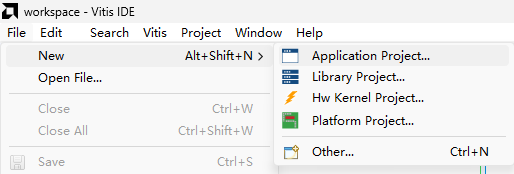
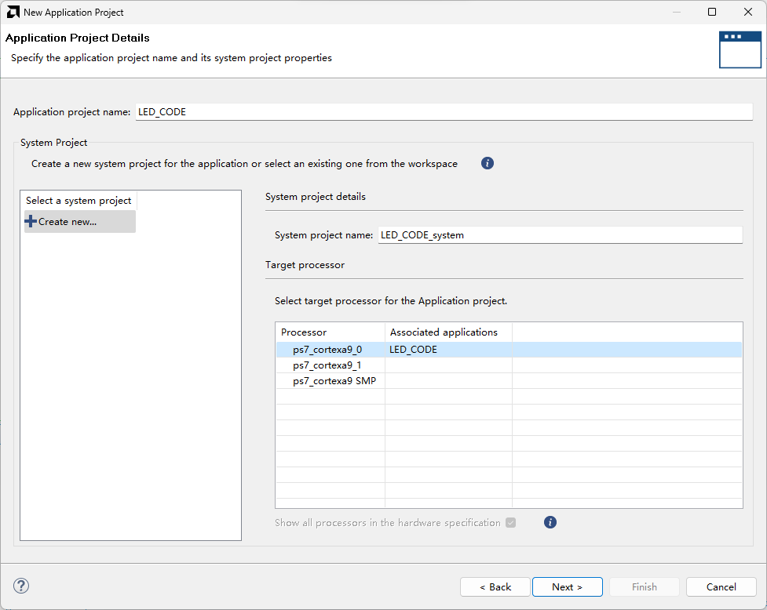
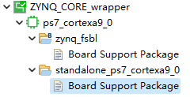

# Vitis IDE-Tutorial

## 0. 说明

本篇教程基于[hellofpga系列教程](http://www.hellofpga.com/index.php/2021/08/02/zynq_ps_to_pl_led_test/). 由于该教程是基于Xilinx SDK的, 而新版Vitis套件已更新为Vitis IDE, 使用方法略有差异. 同时也记录了踩的一些坑. 本教程与hellofpga的前四步(PL端部分)相同, 故略. 

## 5. Vitis IDE程序编写

File-Export-Export hardware, 在弹出的对话框中选择"include bitstream"' 点击“OK”确认.

导出完毕后在Tools-Launch Vitis IDE启动编译器.

选择File-New-Application Project

选择Create a new platform from hardware (XSA), 点击Browse选择Vivado生成的.xsa文件, 点击Next.

给项目起名, 点击Next.

默认配置, 点击Next.

选择空的C语言应用, 点击Finish.

展开Wrapper, 双击.spr文件

进入Board Support Package(BSP)

找到axi_gpio_0, 点击Import Examples.

勾选xgpio_examples, 点击OK.

## 6. 下载到板子上进行验证

点击Vitis-Program Device-Program, 烧录PL端程序.

点击菜单栏Project-Build Project, 等待build完成.

选中导入的例程, 点击上方绿色箭头(Run)右边的箭头, 点击Run As-1 Launch Hardware开始运行.

此时可以看到板载LED在闪烁.

如果看到no targets found with "name =~"APU*"或AP transaction timeout AP transaction timeout或Cannot reset APU. APB AP transaction error, DAP status 0xF0000021等与APU有关的报错的话, 将板子断电重启即可.